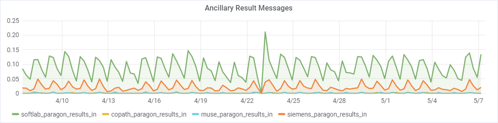

# hcitools
A small collection of utilities created for Infor Cloverleaf

## Graphite

These scripts send Cloverleaf metrics to [Graphite](https://graphiteapp.org/)

The metrics.py script is setup to run once a minute from crontab.  There are some configuration values at the top of the script, which you should modify to point to your graphite install, local temp directory, and Cloverleaf sites you wish to monitor.

**Sample Data:**

As seen in our internal [Grafana](https://grafana.com/) dashboard:

